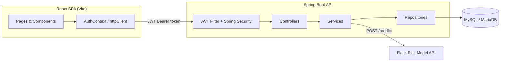
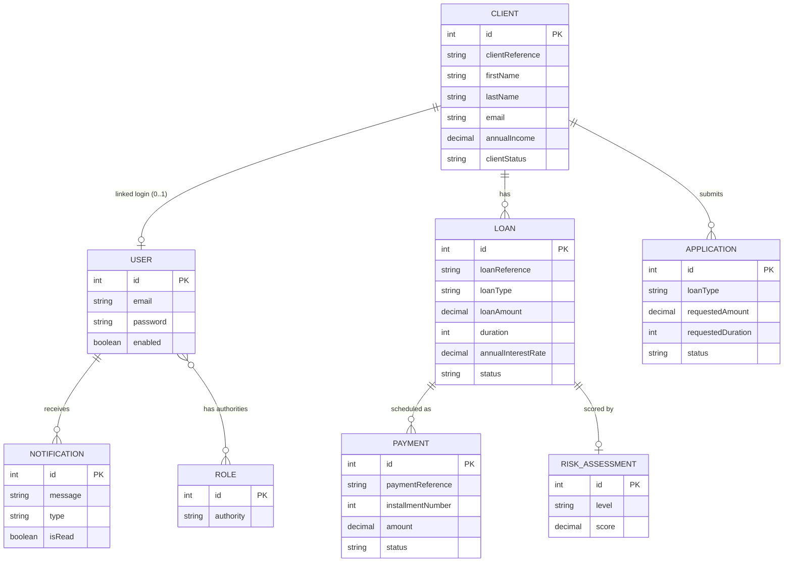

# BanqueApp

BanqueApp is a full-stack banking platform for managing the lifecycle of consumer loans: client onboarding, credit application submission and review, loan issuance, monthly repayment scheduling, and risk scoring — with role-based access for administrators, bank agents, and clients.

It is built as a Spring Boot REST API backed by MySQL/MariaDB, a React single-page frontend, and an external machine-learning microservice used for credit risk prediction. The project demonstrates a layered backend architecture, JWT-based stateless authentication with role-based authorization, and a role-driven frontend that renders an entirely different application shell depending on who is signed in.

---

## Overview

BanqueApp models the real workflow of a lending institution, from a client requesting credit to that credit being fully repaid. Three roles exist, each with a distinct set of capabilities enforced on the backend (not just hidden in the UI):

- **Administrator** — full access: client management, loan and application oversight, payment tracking, risk assessment, and user/account management (creating accounts, assigning roles).
- **Bank Agent** — the operational role: manages clients, reviews and decides on loan applications, manages loans and payment schedules, and runs risk assessments. Does not manage user accounts.
- **Client** — self-service only: manages their own profile, submits loan applications, and views their own loans and payment history. Every "my data" endpoint resolves the caller's identity from the authenticated JWT — a client can never read or act on another client's data by manipulating an id in a request.

---

## Key Features

### Authentication & Security

- Email/password authentication issuing a JWT (HS512-signed, stateless).
- Public self-registration (always creates a `CLIENT` account).
- Role-based authorization enforced at the Spring Security filter-chain level, in addition to route-level guards in the frontend.
- Ownership-safe "my data" endpoints (`/me`) that derive the requesting client from the authenticated principal, never from a client-supplied id.

### Client Management

- Create, update, list, and delete client records (Admin/Bank Agent).
- Self-service client profile creation/update by the authenticated user (`/clients/me`).
- Profile photo upload, replacement, and removal, backed by local file storage.
- Clients are identified externally by a generated business reference (e.g. `CLI-1`), not their internal database id.

### Loan Application Management

- Clients submit loan applications for a requested amount, duration, and loan type.
- Eligibility rules enforced before submission: the client's profile must be complete, and they must have no existing active loan and no other pending application.
- Admin/Bank Agent review queue with an approve/reject decision, which is re-validated (with row-level locking to prevent race conditions) before approval.
- Approving an application automatically creates the corresponding `Loan`.

### Loan Management

- Full CRUD for loans (Admin/Bank Agent), plus a "my loans" view for clients.
- Loan end date is always derived from its approval date and duration, never client-supplied.
- A client cannot take on a new active loan while a previous one still has unpaid installments.
- Loan status (`ACTIVE`, `COMPLETED`, `REJECTED`) is a controlled state machine — an unrelated update can never move a loan out of a terminal state.

### Payment Management

- A full monthly repayment schedule is generated automatically when a loan becomes active (one `Payment` per month of the loan's duration), and generation is idempotent.
- Admin/Bank Agent can mark an installment as paid or revert it.
- A loan automatically transitions to `COMPLETED` once every installment is paid, and back to `ACTIVE` if a payment is later reverted — this transition lives in one place (`PaymentServiceImpl`), not duplicated across the codebase.
- Clients can view their own payment history (`/payments/me`).

### Risk Assessment (Machine Learning Integration)

- The backend delegates credit risk scoring to an external Flask microservice over HTTP, sending income, monthly payment, duration, and interest rate, and receiving back a decision and a numeric risk score.
- Every loan persists a `RiskAssessment` (risk level + score) alongside it.
- The Spring Boot backend does not implement the scoring model itself — the model artifacts (a trained neural network and its scaler) live in `ml-model/`, trained on historical loan data (`ml-model/data/prets.csv`).

### User & Access Management (Administrator only)

- List every user account.
- Create new internal accounts with a chosen role (Admin, Bank Agent, or Client).
- Assign or change a user's role, restricted to `BANK_AGENT` or `CLIENT` — an account can never be promoted to Admin through this endpoint.

---

## Application Workflow

```text
Client
  ↓
Register & Complete Profile
  ↓
Submit Loan Application  ──(rejected: incomplete profile, active loan, or pending application already exists)
  ↓
Application Review (Admin / Bank Agent)
  ↓
Approved ────────────────────────────► Rejected (terminal, traceable, no repayment schedule)
  ↓
Loan Created (ACTIVE) + Risk Assessment recorded
  ↓
Monthly Payment Schedule Generated
  ↓
Payments Tracked (mark paid / revert)
  ↓
All installments paid → Loan COMPLETED
```

---

## Architecture

The backend follows a classic layered architecture, with a strict separation between the persisted domain model and what is exposed over the API:

```text
Controller
    ↓
Service (interface + implementation)
    ↓
Repository (Spring Data JPA)
    ↓
Entity ── mapped to/from ──► DTO   (via a dedicated Mapper per entity)
    ↓
Database (MySQL / MariaDB)
```

- **Controllers** contain no business logic — they translate HTTP requests into service calls and resolve the caller's identity from the `Authentication` object for every `/me` endpoint.
- **Services** own all business rules (eligibility checks, schedule generation, status transitions, risk scoring delegation).
- **Repositories** are plain Spring Data JPA interfaces, using derived query methods (e.g. `findByClient_ClientReference`) rather than hand-written SQL.
- **DTOs and Mappers** decouple the public API shape from the JPA entities — response DTOs are built explicitly per entity rather than serializing entities directly.
- **Global exception handling** (`GlobalExceptionHandler`, `@RestControllerAdvice`) maps around eighteen distinct business exceptions to a single consistent `ApiError` JSON shape.

The frontend is a separate single-page application that talks to the backend exclusively over its REST API (proxied to the same origin in development), authenticating with the JWT issued at login.



---

## Technology Stack

| Category | Technology |
|---|---|
| Backend | Java 21, Spring Boot 4.1 (Web MVC, Data JPA, Security, Validation starter) |
| Frontend | React 19, Vite, React Router DOM |
| Database | MySQL / MariaDB, Hibernate ORM (`ddl-auto=update`) |
| Security | Spring Security, JWT (`io.jsonwebtoken` / jjwt 0.9.1), BCrypt password hashing |
| Styling | Tailwind CSS, custom design tokens (`assets/styles`) |
| HTTP client | Axios (frontend), Spring `RestClient` (backend → Flask) |
| Internationalization | i18next / react-i18next |
| Build tools | Maven (`mvnw` wrapper), npm / Vite |
| API documentation | springdoc-openapi (Swagger UI) |
| AI / ML | External Flask service serving a trained neural network risk model (artifacts under `ml-model/`) |
| Testing | JUnit 5, Mockito, Spring Boot Test |

*Only dependencies actually declared in `pom.xml` and `package.json` are listed. No Docker, CI/CD, or deployment configuration is present in the repository.*

---

## Backend

- **Framework / language**: Spring Boot 4.1 on Java 21, built with Maven.
- **Package structure** (`com.mohcine.banqueApp`): `controller`, `service.interfaces` / `service.impl`, `repository`, `entity`, `enums`, `dto`, `mapper`, `exception`, `filter`, `config`.
- **API design**: resource-oriented REST under `/api/v1/...`, one controller per aggregate (`clients`, `loans`, `applications`, `payments`, `risk-assesments`, `users`, `auth`). Ownership-sensitive resources consistently expose a `/me` endpoint that resolves the caller from the JWT rather than trusting a client-supplied identifier.
- **Persistence**: Spring Data JPA over MySQL/MariaDB; schema evolves automatically via Hibernate (`spring.jpa.hibernate.ddl-auto=update`) — there are no manual migration scripts.
- **Security**: stateless JWT authentication (see [Security](#security)) with authorization rules declared centrally in `SpringSecurityConfig`.
- **Validation**: currently performed manually in controllers/services (e.g. email format and password-length checks in `AuthController` and `UserController`). The `spring-boot-starter-validation` dependency is present but no `jakarta.validation` annotations (`@NotNull`, `@Valid`, etc.) are used yet.
- **Exception handling**: centralized in `GlobalExceptionHandler`, translating domain exceptions (`ClientNotFoundException`, `LoanNotFoundException`, `ApplicationAlreadyDecidedException`, `ActiveLoanExistsException`, etc.) into a uniform `ApiError` response with an appropriate HTTP status.

---

## Frontend

- **Framework**: React 19 with React Router DOM, built and served by Vite.
- **Routing**: not prefix-based — `App.jsx` conditionally mounts an entire route tree based on the authenticated user's role: `AppRoutes` (Admin/Bank Agent), `ClientRoutes` (Client), or `AuthRoutes` (unauthenticated). `ClientRoutes` explicitly redirects internal-only paths (e.g. `/clients/*`, `/loans/*`, `/users/*`) back to the client dashboard.
- **API communication**: a shared Axios instance (`httpClient.js`) attaches the JWT to every request and clears the session on a `401` response. Each domain has its own service module (`clientService`, `loanService`, `applicationService`, `paymentService`, `riskService`, `userService`) that maps backend DTOs to the shape the UI consumes.
- **Authentication handling**: `AuthContext` (built on `useSyncExternalStore`) exposes the current user and `login`/`logout`, backed by a framework-agnostic `authStore` that persists to `localStorage` or `sessionStorage` depending on "remember me".
- **Main application areas**: Dashboard, Client Management, Loan Management, Loan Applications (review), Payment History, Risk Assessment, User Management (Admin) — and a parallel Client portal: Dashboard, My Profile, My Loans, My Applications, My Payments, Settings.
- **Role-based UI**: navigation and available actions differ per role, and are backed by the same authorization rules enforced server-side.

---

## Security

```text
Login (email + password)
  ↓
Spring Security AuthenticationManager / DaoAuthenticationProvider
  ↓
JWT generated (HS512, signed with a configured secret)
  ↓
Client stores the token and sends it as "Authorization: Bearer <token>"
  ↓
JwtAutorisationFilter validates the token on every request
  ↓
SecurityContext populated with the authenticated user and roles
  ↓
Endpoint-level role check (Spring Security authorizeHttpRequests)
```

- **Roles**: `ROLE_ADMIN`, `ROLE_BANK_AGENT`, `ROLE_CLIENT`.
- **Session model**: stateless (`SessionCreationPolicy.STATELESS`); CSRF is disabled, consistent with a token-based API that carries no session cookie.
- **Endpoint protection** (declared in `SpringSecurityConfig`):

| Endpoint(s) | Access |
|---|---|
| `/api/v1/auth/**`, Swagger/OpenAPI paths | Public |
| `.../me` endpoints (clients, loans, applications, payments) | Any authenticated user (identity resolved from the JWT) |
| `/api/uploads/**` | Any authenticated user |
| `POST /api/v1/applications` | `ROLE_CLIENT` |
| `GET /api/v1/applications`, `PUT /api/v1/applications/{id}/decision` | `ROLE_ADMIN` or `ROLE_BANK_AGENT` |
| `PUT /api/v1/payments/{id}/mark-paid` / `mark-unpaid` | `ROLE_ADMIN` or `ROLE_BANK_AGENT` |
| `/api/v1/clients/**`, `/api/v1/payments/**`, `/api/v1/loans/**`, `/api/v1/risk-assesments/**` (all non-`/me` routes) | `ROLE_ADMIN` or `ROLE_BANK_AGENT` |
| `/api/v1/users/**` | `ROLE_ADMIN` only |
| Everything else | Any authenticated user |

No credentials, secrets, or key material are included in this document — the signing secret and database credentials are configured locally via `application.properties` (see [Environment Variables](#environment-variables)).

---

## API Endpoints

### Authentication

| Method | Endpoint | Description | Access |
|---|---|---|---|
| POST | `/api/v1/auth/login` | Authenticate and receive a JWT, role, and client reference | Public |
| POST | `/api/v1/auth/register` | Self-register a new `CLIENT` account | Public |

### Clients

| Method | Endpoint | Description | Access |
|---|---|---|---|
| GET | `/api/v1/clients/me` | Get the authenticated user's own client profile | Authenticated |
| PUT | `/api/v1/clients/me` | Create or update the authenticated user's own profile | Authenticated |
| POST | `/api/v1/clients/me/profile-photo` | Upload/replace own profile photo | Authenticated |
| DELETE | `/api/v1/clients/me/profile-photo` | Remove own profile photo | Authenticated |
| GET | `/api/v1/clients` | List all clients | Admin / Bank Agent |
| GET | `/api/v1/clients/reference/{reference}` | Get a client by business reference | Admin / Bank Agent |
| POST | `/api/v1/clients` | Create a client | Admin / Bank Agent |
| PUT | `/api/v1/clients/reference/{reference}` | Update a client | Admin / Bank Agent |
| DELETE | `/api/v1/clients/{id}` | Delete a client by id | Admin / Bank Agent |
| DELETE | `/api/v1/clients/reference/{reference}` | Delete a client by reference | Admin / Bank Agent |

### Loan Applications

| Method | Endpoint | Description | Access |
|---|---|---|---|
| POST | `/api/v1/applications` | Submit a loan application (client is the authenticated user) | `ROLE_CLIENT` |
| GET | `/api/v1/applications/me` | List the authenticated client's own applications | Authenticated |
| GET | `/api/v1/applications` | List all applications (review queue) | Admin / Bank Agent |
| PUT | `/api/v1/applications/{id}/decision` | Approve or reject an application | Admin / Bank Agent |

### Loans

| Method | Endpoint | Description | Access |
|---|---|---|---|
| GET | `/api/v1/loans/me` | List the authenticated client's own loans | Authenticated |
| GET | `/api/v1/loans` | List all loans | Admin / Bank Agent |
| GET | `/api/v1/loans/{clientId}` | List a client's loans by internal id | Admin / Bank Agent |
| GET | `/api/v1/loans/client/reference/{reference}` | List a client's loans by reference | Admin / Bank Agent |
| POST | `/api/v1/loans` | Create a loan | Admin / Bank Agent |
| PUT | `/api/v1/loans/{id}` | Update a loan | Admin / Bank Agent |
| DELETE | `/api/v1/loans/{id}` | Delete a loan | Admin / Bank Agent |

### Payments

| Method | Endpoint | Description | Access |
|---|---|---|---|
| GET | `/api/v1/payments/me` | List the authenticated client's own payments | Authenticated |
| GET | `/api/v1/payments/loan/{loanId}` | Get the full repayment schedule for a loan | Admin / Bank Agent |
| PUT | `/api/v1/payments/{id}/mark-paid` | Mark an installment as paid | Admin / Bank Agent |
| PUT | `/api/v1/payments/{id}/mark-unpaid` | Revert an installment to unpaid | Admin / Bank Agent |

### Risk Assessment

| Method | Endpoint | Description | Access |
|---|---|---|---|
| POST | `/api/v1/risk-assesments/calculate-risk` | Score a prospective loan via the external ML model | Admin / Bank Agent |

### Users (Administration)

| Method | Endpoint | Description | Access |
|---|---|---|---|
| GET | `/api/v1/users` | List all user accounts | Admin |
| POST | `/api/v1/users` | Create a new account (Admin, Bank Agent, or Client) | Admin |
| PUT | `/api/v1/users/{id}/role` | Assign a role (Bank Agent or Client) to a user | Admin |

---

## Database

MySQL/MariaDB, accessed through Spring Data JPA. The schema is not hand-written — it is derived from the JPA entities and kept in sync automatically (`hibernate.ddl-auto=update`).



All relationships above were verified directly against the JPA annotations (`@OneToOne`, `@OneToMany`/`mappedBy`, `@ManyToOne`, `@ManyToMany`) — none are inferred or assumed.

---

## Project Structure

```text
BanqueApp-SpringBoot/
├── backend/
│   └── src/main/java/com/mohcine/banqueApp/
│       ├── controller/     REST controllers (one per aggregate)
│       ├── service/
│       │   ├── interfaces/
│       │   └── impl/
│       ├── repository/     Spring Data JPA repositories
│       ├── entity/         JPA entities
│       ├── enums/          Domain enumerations
│       ├── dto/            Request/response DTOs
│       ├── mapper/         Entity ↔ DTO mappers
│       ├── exception/      Domain exceptions + GlobalExceptionHandler
│       ├── filter/         JWT authorization filter
│       └── config/         Security, CORS, web, and REST client configuration
│
├── frontend/
│   └── src/
│       ├── pages/          Admin/Bank Agent screens (+ pages/auth, pages/client)
│       ├── components/     UI grouped by domain (clients, loans, payments, layout, ui)
│       ├── routes/         AppRoutes, ClientRoutes, AuthRoutes
│       ├── services/       One HTTP service module per resource
│       ├── auth/           AuthContext, authStore, authService
│       └── hooks/          Data-fetching hooks per resource
│
└── ml-model/                Trained risk model artifacts (scaler, neural network, training data)
```

---

## Getting Started

### Prerequisites

- Java 21 and Maven (the `mvnw` wrapper is included)
- Node.js and npm
- A running MySQL/MariaDB instance
- Python + Flask, only if you intend to exercise the risk-scoring feature (its server code is not included in this repository — see [Risk Assessment](#risk-assessment-machine-learning-integration))

### Backend setup

1. Create a database matching the name configured in `spring.datasource.url`.
2. Review `backend/src/main/resources/application.properties` and adjust the datasource credentials and JWT secret for your environment.
3. Run the application:

   ```bash
   cd backend
   ./mvnw spring-boot:run
   ```

4. The API starts on `http://localhost:8080`. On first startup, a small set of seed accounts (one per role) is created automatically for local testing.

### Frontend setup

1. Install dependencies:

   ```bash
   cd frontend
   npm install
   ```

2. Start the development server:

   ```bash
   npm run dev
   ```

3. Vite proxies `/api/*` requests to the backend on port 8080, so no additional configuration is required for local development.

### Environment Variables

The backend currently reads its configuration from `application.properties` rather than a `.env` file; the equivalent values can also be supplied as environment variables (Spring Boot's standard relaxed binding) when running the packaged application:

```env
DATABASE_URL=jdbc:mysql://localhost:3306/your_database
DATABASE_USERNAME=your_username
DATABASE_PASSWORD=your_password
JWT_SECRET=your_secret
```

The frontend accepts one optional variable (no `.env` file is currently checked into the repository):

```env
VITE_API_BASE_URL=/api
```

---

## API Documentation

Swagger UI is configured via `springdoc-openapi-starter-webmvc-ui` and is publicly reachable while the backend is running:

- Swagger UI: `http://localhost:8080/swagger-ui.html`
- OpenAPI spec: `http://localhost:8080/v3/api-docs`

---

## Testing

Automated tests exist for the backend only, using JUnit 5 and Mockito:

- `ApplicationServiceImplTest`, `ClientServiceImplTest`, `LoanServiceImplTest`, `PaymentServiceImplTest`, `UserServiceImplTest` — unit tests for the service layer.
- `BackendApplicationTests` — verifies the full Spring application context loads successfully.

Run them with:

```bash
cd backend
./mvnw test
```

No automated frontend tests are present in the repository.

---

## Screenshots

> Screenshots coming soon.

---

## Engineering Highlights

- **Layered backend architecture** with a clean separation between Controller, Service, Repository, Entity, DTO, and Mapper responsibilities.
- **Ownership-safe API design**: every "my data" endpoint resolves the resource owner from the authenticated JWT principal, never from a client-supplied identifier — closing off a common class of broken-object-level-authorization bugs by construction.
- **Stateless JWT authentication combined with role-based authorization** enforced centrally in the Spring Security filter chain, not only in the frontend.
- **Concurrency-aware business rules**: application decisions use pessimistic row locking (`findByIdForUpdate`, `findByClientReferenceForUpdate`) so two simultaneous approvals can't both grant a client an active loan.
- **Self-managing state machine for loans**: repayment schedule generation is idempotent, and a loan's `ACTIVE ⇄ COMPLETED` transition is derived automatically and consistently from its payment state in a single place.
- **Centralized, consistent error handling** via `@RestControllerAdvice`, mapping ~18 domain-specific exceptions to a uniform `ApiError` response.
- **External ML integration**: credit risk scoring is cleanly delegated to a separate Flask service over HTTP, keeping the trained model out of the Java codebase entirely.
- **Role-driven frontend composition**: the frontend mounts one of three entirely separate route trees based on the authenticated role, rather than gating individual routes.

---

## Future Improvements

> Planned / Future Improvements

- Expose business reference identifiers (e.g. loan and application references) consistently across all response DTOs instead of internal database ids, mirroring what is already done for clients and payments.
- Add a dedicated `AuthenticationEntryPoint` / `AccessDeniedHandler` so authentication/authorization failures return the same `ApiError` shape as the rest of the API.
- Adopt declarative request validation (`jakarta.validation` annotations), for which the dependency is already present but unused.
- Add automated frontend tests and a CI pipeline.
- Containerize the backend, frontend, and risk-scoring service for reproducible deployment.

---

## Author

**Mohcine Lamtanez**

Software Engineering Student | Backend Developer | Java & Spring Boot | Generative AI

- LinkedIn: _https://www.linkedin.com/in/mohcine-lamtanez-dev/_
- GitHub: _https://github.com/mohcinelamtanez_
- Portfolio: _Coming soon_
